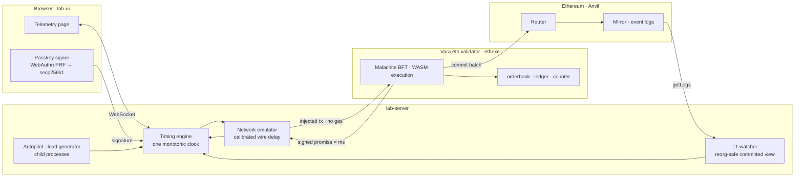
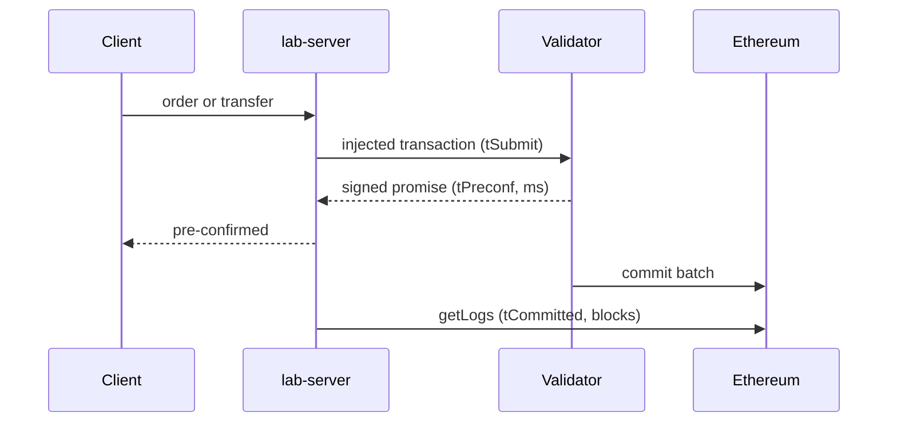

# vara-eth-runner

A local Vara.eth lab that measures what a validator pre-confirmation is worth: how fast it arrives, how much throughput one validator sustains, how long until Ethereum settles it, and what happens to it when Ethereum reorganises.

Everything runs on one machine: a gear v2.0.0 ethexe node with an embedded Anvil, Sails 2.0 programs, a Node measurement engine, and a live telemetry page with passkey signing.

## What it shows

- **Pre-confirmation in about 200 ms** with the real wire latency to Gear's infrastructure emulated from a live measurement, or single-digit milliseconds on loopback.
- **About 600 transactions per second sustained** by one validator on a laptop, 800 in the best second, measured from the program's own counter with pre-signed transactions.
- **Ethereum settlement** a few blocks later, rebuilt only from Mirror contract logs, so the validator's view and Ethereum's view can be compared.
- **The reorg boundary**: a reorg is absorbed if its depth is at most canonical-quarantine + 1; deeper, the validator keeps issuing signed promises that never settle.
- **A passkey wallet**: WebAuthn PRF secret → HKDF → secp256k1 key in the browser; sends on a ledger program and orders on the book, each showing its pre-confirmation time.

Every figure on the page is measured on the running stack. Nothing is quoted.

## Architecture





## Layout

```
orderbook/   Sails 2.0 ethexe order book driven by the autopilot; events carry sequence numbers
ledger/      balances, transfer, one-time faucet — behind the wallet's Send tab
counter/     one u64 increment, no events — the throughput probe target
lab-server/  engine, watcher, autopilot, load/fire/sample probes, benchmark, reorg matrix, WS server
lab-ui/      telemetry page: band, tiles, tape, settlement, Controls and Wallet drawers
run/         start-node.sh · deploy.sh · deploy-ledger.sh · deploy-counter.sh · key table
docs/        architecture, roadmap, results, retro, Excalidraw diagram      reports/  benchmark and reorg outputs
```

## Quick start

Prerequisites: Rust, `protoc`, `cmake`, Node 22, `cargo install sails-cli --version 2.0.0`, and **Foundry 1.7.0 exactly** (`foundryup --install 1.7.0`; the dev node refuses other builds).

```bash
git clone --depth 1 --branch v2.0.0 https://github.com/gear-tech/gear.git gear
(cd gear && cargo build -p ethexe-cli --release)                 # ~25 min once
for p in orderbook ledger counter; do (cd $p && cargo build --release); done
run/start-node.sh --quarantine 0 && run/deploy.sh                # node + Anvil, 5 book instances, ledger
(cd lab-server && npm install && npm run serve)                  # ws://127.0.0.1:8787, autopilot on
(cd lab-ui && npm install && npm run dev)                        # http://localhost:5173
```

## On the page

- **Band**: pre-confirmed transactions per half second over the last three minutes, gliding continuously.
- **Tiles**: latest Ethereum height, median pre-confirmation, fastest, pre-confirmed count.
- **Transactions**: the live tape with each transaction's pre-confirmation time; passkey transactions are marked.
- **Ethereum settlement**: program events committed per block.
- **Controls**: network profile (loopback / measured / global), autopilot rate up to 600 tx/s, recycle, load test.
- **Wallet**: create or use a passkey, Send units on the ledger, Trade on the book.

## Experiments

```bash
cd lab-server
npm test                                  # offline + live tests (live ones use a quiet 5th book instance)
npm run blast -- 1000 64 8                # live-path load: N tx, K in flight, S accounts
npm run bench -- 30                       # both write paths, per-hop latency → reports/
npm run reorg-matrix                      # quarantine × depth, restarts the node per cell → reports/
INSTANCES=16 EXEC_BALANCE=25000000000000000 ../run/deploy-counter.sh
npx tsx src/fire-cli.ts 3000 128 1 16     # pre-signed fire-and-forget; executed/s from the counter
npx tsx src/sample-cli.ts 30              # independent sampler while several fire processes run
```

Full numbers and method: [`docs/03-results.md`](docs/03-results.md).

## How the numbers are produced

- **Pre-confirmation latency**: one monotonic clock in one process. `tSubmit` is taken right before `injected_sendTransactionAndWatch`, `tPreconf` when the validator-signed receipt arrives. Signing and the reference-block fetch happen before `tSubmit`.
- **Network emulation**: a WebSocket proxy delays every frame to and from the validator by half of a round trip measured live against `wss://rpc.vara.network` at startup, plus jitter and occasional spikes. Loopback flatters the numbers; this puts the wire back.
- **Committed view**: a replay of the program's event logs on the Mirror contract, rebuilt from genesis whenever the last seen block hash stops being canonical. Nothing from the validator enters it.
- **Throughput ceiling**: transactions pre-signed, submitted without subscriptions, executed count read from the counter program itself.

## Limits worth knowing

- **Four outgoing messages per execution** (`MAX_OUTGOING_MESSAGES_PER_EXECUTION`): every eth event counts, so the order book performs at most three fills per order and rests the remainder.
- **Executable balance pays for execution**: 1,000 WVARA covered about 6,000 executions; instances are deployed with 25,000.
- **Reference block validity**: 32 blocks; transactions signed too early are rejected as outdated.
- **Mempool**: about 10,000 transactions; the RPC accepts ~30,000 submissions/s; a JavaScript process signs ~290/s, so the autopilot splits high rates across processes.
- **The dev node's `--tmp` store is never pruned**: ~2.7 GB/min at 400 tx/s and the node slows as it grows. The server recycles node, Anvil, and deployments every 30 min or above 40 GB and says so on the page.
- Single local validator; the programs are lab toys; Hoodi testnet was down during this work.

## Pitfalls that cost time

- Dev mode needs `--validators-malachite-pub-keys` (`run/malachite-validators.json`); it is not generated.
- A Mirror is uninitialised until its first **L1** message carries the constructor; injected transactions before that are silently purged.
- `@vara-eth/api` 0.6.0-rc.0 against a v2.0.0 node signs the wrong digest ("Address mismatch"); one instance override fixes it (`lab-server/src/engine.ts`).
- `u8` and `bool` cannot appear in ethexe events or ABI parameters; use `u32`/`u64`. Build with `gstd-panic-message` or panics read as `<unknown>`.
- Restarting the node before the old Anvil releases :8545 attaches it to the old chain; `run/start-node.sh` waits and verifies a fresh chain.

## License

Lab code: MIT. `gear` and the vendored `@vara-eth/api` are GPL-3.0 upstream.
