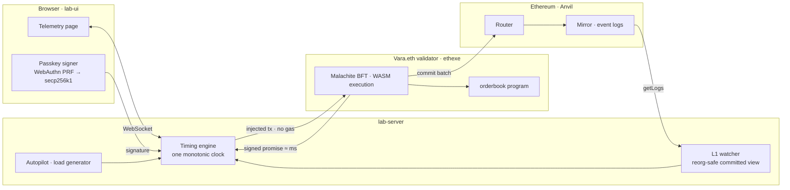
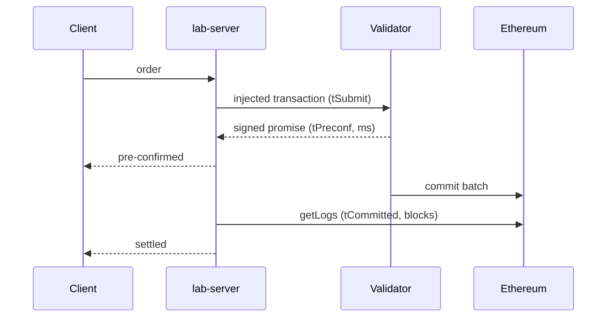

<p align="left"></p>

# vara-eth-runner

A local Vara.eth lab that measures what a validator pre-confirmation is worth: how fast it arrives, how much throughput one validator sustains, how long until Ethereum settles it, and what happens to it when Ethereum reorganises.

Everything runs on one machine: a gear v2.0.0 ethexe node with an embedded Anvil, a Sails 2.0 order-book program, a Node measurement engine, and a live telemetry page with passkey signing.

## Architecture





Editable diagram: [`docs/architecture.excalidraw`](docs/architecture.excalidraw). Results: [`docs/03-results.md`](docs/03-results.md).

## Layout

```
orderbook/   Sails 2.0 ethexe program (Rust → WASM)
lab-server/  timing engine, committed-view watcher, autopilot, benchmark, reorg matrix, WS server
lab-ui/      telemetry page with passkey wallet
run/         start-node.sh · deploy.sh          docs/ · reports/ · vendor/
```

## Run

Prerequisites: Rust, `protoc`, `cmake`, Node 22, `cargo install sails-cli --version 2.0.0`, and **Foundry 1.7.0 exactly** (`foundryup --install 1.7.0`).

```bash
git clone --depth 1 --branch v2.0.0 https://github.com/gear-tech/gear.git gear && (cd gear && cargo build -p ethexe-cli --release)
(cd orderbook && cargo build --release)
run/start-node.sh --quarantine 0 && run/deploy.sh
(cd lab-server && npm install && npm run serve)     # ws://127.0.0.1:8787
(cd lab-ui && npm install && npm run dev)           # http://localhost:5173
```

Experiments, from `lab-server`: `npm test`, `npm run blast -- 1000 64 8`, `npm run bench -- 30`, `npm run reorg-matrix`.

## Network conditions

Loopback flatters the figures. The server runs a WebSocket emulator in front of the validator RPC that delays every frame
by a one-way latency **calibrated live** against `wss://rpc.vara.network` (the region Vara.eth validators are hosted in;
~180 ms round trip from Mumbai), plus jitter and occasional spikes. With it on, pre-confirmations measure ~210 ms median,
~250 ms p95, which is what a hosted validator would deliver from here. Profiles: loopback, measured, global (240 ms).
Select on the page or set `LAB_NET_PROFILE`, `LAB_CALIBRATE_URL`.

## Notes

- Latency is one clock in one process: `tSubmit` after signing, `tPreconf` on the validator-signed receipt, `tCommitted` when the log is seen on Ethereum.
- Passkeys: the PRF secret seeds a secp256k1 key in the browser via HKDF; the key never leaves it.
- The dev node persists every micro-block to an unpruned `--tmp` store (64 GB in 40 min at 25 tx/s) and slows as it grows; the server recycles it every 10 min or on latency creep and says so on the page.
- Single local validator; the order book is a lab toy. Pitfalls and verified node behaviour: [`.prism/project-model.md`](.prism/project-model.md).

MIT for lab code; `gear` and the vendored `@vara-eth/api` are GPL-3.0.
