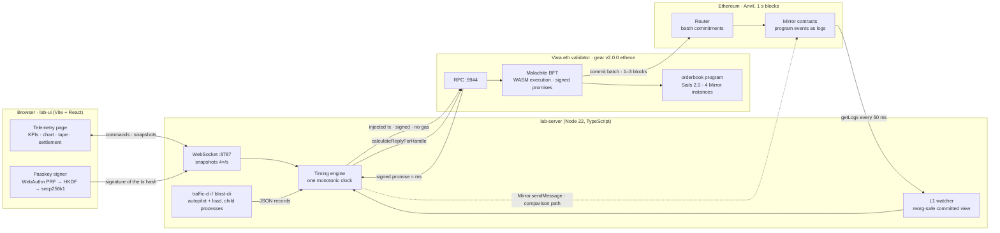
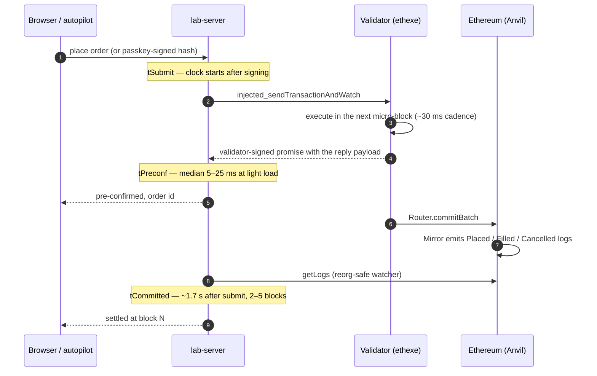

<p align="left"></p>

# vara-eth-runner

A local Vara.eth lab that measures what a validator pre-confirmation is worth: how fast it arrives, how much throughput one validator sustains, how long until Ethereum settles it, and what happens to it when Ethereum reorganises.

Everything runs on one machine: a gear v2.0.0 ethexe node with an embedded Anvil, a Sails 2.0 order-book program, a Node measurement engine, and a live telemetry page with passkey signing.

## Architecture



### Life of one transaction



### Two views of one program state

| View | Source | Freshness | Trust |
|---|---|---|---|
| Pre-confirmed | `program_calculateReplyForHandle` against the validator's latest computed block | milliseconds | the validator's signature |
| Committed | replay of the program's event logs on the Mirror contract, rebuilt from genesis on any reorg | 1–3 Ethereum blocks | Ethereum |

The gap between them is what the page measures. Forcing a reorg with `anvil_reorg(depth)` shows the rule: depth ≤ canonical-quarantine + 1 is absorbed; deeper, the validator keeps signing promises that never settle.

Editable diagram: [`docs/architecture.excalidraw`](docs/architecture.excalidraw) · static render: [`docs/architecture.svg`](docs/architecture.svg).

## Measured results

Fresh stack, M-series laptop, one validator. Details and per-transaction records in [`reports/`](reports) and [`docs/03-results.md`](docs/03-results.md).

| Scenario | Result |
|---|---|
| Pre-confirmation, light load (25 tx/s) | median 5–25 ms, fastest 1.9 ms |
| 500 tx, 32 in flight | ~320 tx/s, median 76–80 ms |
| 1000 tx, 64 in flight | ~470 tx/s, median 91 ms, p95 159 ms |
| Ceiling | ~500 tx/s with 1 or 4 program instances: the validator's block pipeline, not WASM execution |
| Pre-confirmation → settled | ~1.7 s median (2–5 blocks) |
| Ethereum-transaction path | ~1 s to mine, ~4 s to settle, no pre-confirmation |
| Reorg safety | absorbed iff depth ≤ canonical-quarantine + 1 |

## Repository layout

```
orderbook/    Sails 2.0 ethexe program (Rust → WASM): order book, eth events with sequence numbers, unit + gtest
lab-server/   timing engine, committed-view watcher, autopilot, load generator, benchmark, reorg matrix, WS server
lab-ui/       telemetry page: KPIs, chart, latency histogram, tape, settlement, wallet drawer with passkeys
run/          start-node.sh (node + Anvil, verified fresh) · deploy.sh (upload, create N instances, init) · key table
docs/         architecture, roadmap, results, retro, diagrams        reports/  benchmark and reorg-matrix outputs
vendor/       @vara-eth/api 0.6.0-rc.0 tarball (as shipped inside vara-wallet 0.20.6; GPL-3.0)
```

## Prerequisites

- macOS or Linux, Rust via rustup (the node pins `nightly-2025-10-20` through its own `rust-toolchain.toml`), `protoc`, `cmake`
- **Foundry 1.7.0 exactly**: `foundryup --install 1.7.0`. The dev node refuses any other Anvil build.
- Node 22 and `cargo install sails-cli --version 2.0.0`

## Build the node once (~25 min)

```bash
git clone --depth 1 --branch v2.0.0 https://github.com/gear-tech/gear.git gear
cd gear && cargo build -p ethexe-cli --release && cd ..
```

## Run

```bash
cd orderbook && cargo build --release && cd ..     # WASM + IDL
run/start-node.sh --quarantine 0                    # ethexe dev node + Anvil :8545, RPC :9944; verifies a fresh chain
run/deploy.sh                                       # upload, create 4 instances, initialise each
cd lab-server && npm install && npm run serve      # ws://127.0.0.1:8787; starts the autopilot (LAB_AUTOPILOT_RATE, default 25)
cd lab-ui && npm install && npm run dev            # http://localhost:5173
```

`--quarantine N` sets the validator's canonical quarantine; it anchors N+1 blocks behind the Ethereum head.

## Experiments

```bash
cd lab-server
npm test                        # 5 offline + 6 live tests
npm run blast -- 1000 64 8      # load: N transactions, K in flight, S accounts → tx/s and latency percentiles
npm run bench -- 30             # both paths, per-hop latency → reports/bench-*.md
npm run reorg-matrix            # quarantine {0,4} × depth {1,3,6}, restarts the node per cell → reports/reorg-matrix-*.md
cd ../lab-ui && npm run render-check   # server-renders the page with a live snapshot; no browser needed
```

## How the numbers are produced

- **Pre-confirmation latency**: one monotonic clock in one process. `tSubmit` is taken right before `injected_sendTransactionAndWatch`, `tPreconf` when the validator-signed receipt arrives. Signing and the reference-block fetch happen before `tSubmit`.
- **Committed timestamps** are observation times: mine time plus at most one 50 ms poll and a `getLogs` round trip. Every report says so.
- **Passkeys**: WebAuthn P-256 cannot produce the secp256k1 signature the validator recovers, so the passkey's PRF secret seeds a secp256k1 key via HKDF in the browser. The server prepares the transaction hash and relays the signature; the key never leaves the browser.
- **Autopilot**: a child process keeps a steady rate across four program instances with periodic surges, so the page is alive without input.

## Known limitations

- Single validator on one machine. Hoodi testnet was down during this work; nothing has run off the local stack.
- The order book is a lab toy: free, permissionless `place`, owner-only `cancel`, 256 resting orders per side.
- Each order emits two events and Ethereum settlement absorbs ~120 events per 1 s block. Sustained rates above ~60 tx/s build an unsettled backlog and the median creeps up. Restart the stack before benchmarking.
- The reorg matrix is one trial per cell.

## Pitfalls that cost time

- Dev mode needs a `--validators-malachite-pub-keys` JSON (`run/malachite-validators.json`); it is not generated.
- A Mirror is uninitialised until its first **L1** message carries the constructor. Injected transactions to it are silently purged as `UninitializedDestination` and surface 32 blocks later as `Outdated`.
- `@vara-eth/api` 0.6.0-rc.0 against a v2.0.0 node: right envelope, wrong digest ("Address mismatch"). One instance override fixes it (`lab-server/src/engine.ts`, `createInjectedTx`).
- `u8` and `bool` are not usable in ethexe events or ABI parameters; use `u32` / `u64`.
- Restarting the node before the old Anvil releases :8545 attaches it to the old chain; `run/start-node.sh` waits and verifies.

## License

Lab code: MIT. `gear` and the vendored `@vara-eth/api` are GPL-3.0 upstream.
