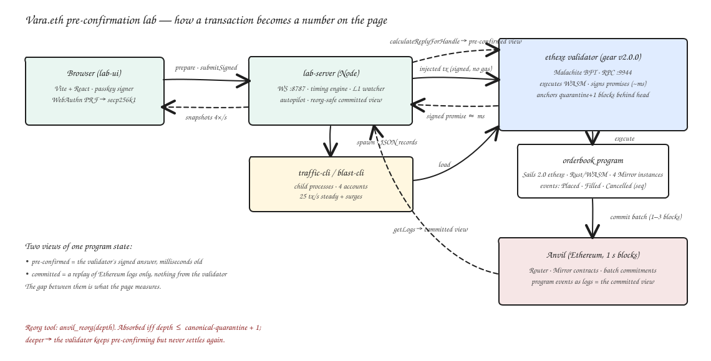

# vara-eth-runner

A local Vara.eth lab that measures what a validator **pre-confirmation** is worth: how fast it arrives, how much
throughput one validator sustains, how long until Ethereum settles it, and what happens to it when Ethereum reorganises.

Everything runs on one machine: a gear v2.0.0 `ethexe` node with an embedded Anvil, a Sails 2.0 order-book program,
a Node measurement engine, and a live telemetry page with passkey signing.



Editable diagram: [`docs/architecture.excalidraw`](docs/architecture.excalidraw) (open at excalidraw.com).

## What it shows

| Measured on a fresh stack (M-series laptop, one validator) | |
|---|---|
| Pre-confirmation, light load (25 tx/s) | median 5–25 ms, fastest 1.9 ms |
| Pre-confirmation, 500 tx at 32 in flight | ~320 tx/s, median 76–80 ms |
| Pre-confirmation, 1000 tx at 64 in flight | ~470 tx/s, median 91 ms, p95 159 ms |
| Ceiling | ~500 tx/s regardless of 1 or 4 program instances — the validator's block pipeline, not WASM execution |
| Pre-confirmation → settled on Ethereum | ~1.7 s median (2–5 blocks) |
| Ethereum-transaction path (Mirror.sendMessage) | ~1 s to mine, ~4 s to settle, no pre-confirmation |
| Reorg safety | absorbed iff depth ≤ canonical-quarantine + 1; deeper, the validator keeps signing promises that never settle |

Reports with per-transaction records: [`reports/`](reports). Full findings and pitfalls: [`docs/04-retro.md`](docs/04-retro.md),
[`.prism/project-model.md`](.prism/project-model.md).

## Repository layout

```
orderbook/    Sails 2.0 ethexe program (Rust → WASM): price-time order book, eth events with sequence numbers, unit + gtest
lab-server/   Node 22 + TypeScript: timing engine, reorg-safe committed view from Ethereum logs, autopilot traffic,
              load generator, benchmark, reorg matrix, WebSocket telemetry server, passkey prepare/submit
lab-ui/       Vite + React telemetry page: KPIs, throughput/latency chart, latency histogram, transaction tape,
              settlement view, wallet drawer with WebAuthn passkey signing, fault-injection controls
run/          start-node.sh (node + Anvil, verified fresh), deploy.sh (upload, create N instances, init), Malachite key table
docs/         architecture, roadmap, retro, diagrams        reports/  benchmark and reorg-matrix outputs
vendor/       @vara-eth/api 0.6.0-rc.0 tarball (as shipped inside vara-wallet 0.20.6; GPL-3.0)
```

## Prerequisites

- macOS or Linux, Rust (rustup; the node pins `nightly-2025-10-20` via its own `rust-toolchain.toml`), `protoc`, `cmake`
- **Foundry 1.7.0 exactly**: `foundryup --install 1.7.0` — the dev node refuses any other Anvil build
- Node 22, `cargo install sails-cli --version 2.0.0`

## Build the node (once, ~25 min)

```bash
git clone --depth 1 --branch v2.0.0 https://github.com/gear-tech/gear.git gear
cd gear && cargo build -p ethexe-cli --release && cd ..
```

## Run

```bash
run/start-node.sh --quarantine 0          # ethexe dev node + Anvil :8545, RPC :9944; verifies the chain is fresh
run/deploy.sh                             # build artefacts must exist: cd orderbook && cargo build --release
cd lab-server && npm install && npm run serve      # ws://127.0.0.1:8787, starts the autopilot (LAB_AUTOPILOT_RATE, default 25)
cd lab-ui && npm install && npm run dev            # http://localhost:5173
```

`--quarantine N` sets the validator's canonical quarantine; it anchors N+1 blocks behind the Ethereum head.

## Experiments

```bash
cd lab-server
npm test                        # 5 offline + 6 live tests
npm run blast -- 1000 64 8      # load: N transactions, K in flight, S accounts → tx/s and latency percentiles
npm run bench -- 30             # both paths, per-hop latency → reports/bench-*.md
npm run reorg-matrix            # quarantine {0,4} × depth {1,3,6}, restarts the node per cell → reports/reorg-matrix-*.md
cd ../lab-ui && npm run render-check   # server-renders the page with a live snapshot (no browser needed)
```

## How the numbers are produced

- **Pre-confirmation latency** is one monotonic clock in one process: `tSubmit` right before `injected_sendTransactionAndWatch`,
  `tPreconf` when the validator-signed receipt arrives. Signing and reference-block fetch happen before `tSubmit`.
- **Pre-confirmed view** of the book: `program_calculateReplyForHandle` against the validator's latest computed block.
- **Committed view**: a replay of the program's `Placed/Filled/Cancelled` logs on the Mirror contract, rebuilt from genesis
  whenever the last seen block hash stops being canonical. Nothing from the validator enters it.
- **Passkeys**: WebAuthn P-256 cannot produce the secp256k1 signature the validator recovers, so the passkey's PRF secret
  seeds a secp256k1 key via HKDF in the browser; the server prepares the transaction hash and relays the signature.
- **Autopilot**: a child process keeps a steady rate across four program instances with periodic surges, so the page is
  alive without input. Bursts and manual orders add to the same tape.

## Known limitations

- Single validator on one machine; Hoodi testnet was down during this work, nothing here has run off the local stack.
- The order book is a lab toy: free, permissionless `place`, owner-only `cancel`, 256 resting orders per side.
- Each order emits two events and Ethereum settlement absorbs ~120 events per 1 s block; sustained rates above ~60 tx/s build
  an unsettled backlog and the median creeps up. The dev node also slows after tens of thousands of transactions in one run;
  restart the stack before benchmarking.
- Committed timestamps are observation times (mine time + ≤ 50 ms poll). The reorg matrix is one trial per cell.

## Pitfalls that cost time (so you don't pay them)

- Dev mode needs a `--validators-malachite-pub-keys` JSON (`run/malachite-validators.json`); it is not generated.
- A Mirror is uninitialized until its first **L1** message carries the constructor; injected transactions to it are
  silently purged as `UninitializedDestination` and surface 32 blocks later as `Outdated`.
- `@vara-eth/api` 0.6.0-rc.0 against a v2.0.0 node: right envelope, wrong digest ("Address mismatch"); one instance
  override fixes it (`lab-server/src/engine.ts`, `createInjectedTx`).
- `u8` and `bool` are not usable in ethexe events or ABI parameters; use `u32`/`u64`.
- Restarting the node before the old Anvil releases :8545 attaches it to the old chain; `run/start-node.sh` now waits and verifies.

## License

Lab code: MIT. `gear` and the vendored `@vara-eth/api` are GPL-3.0 (upstream).
